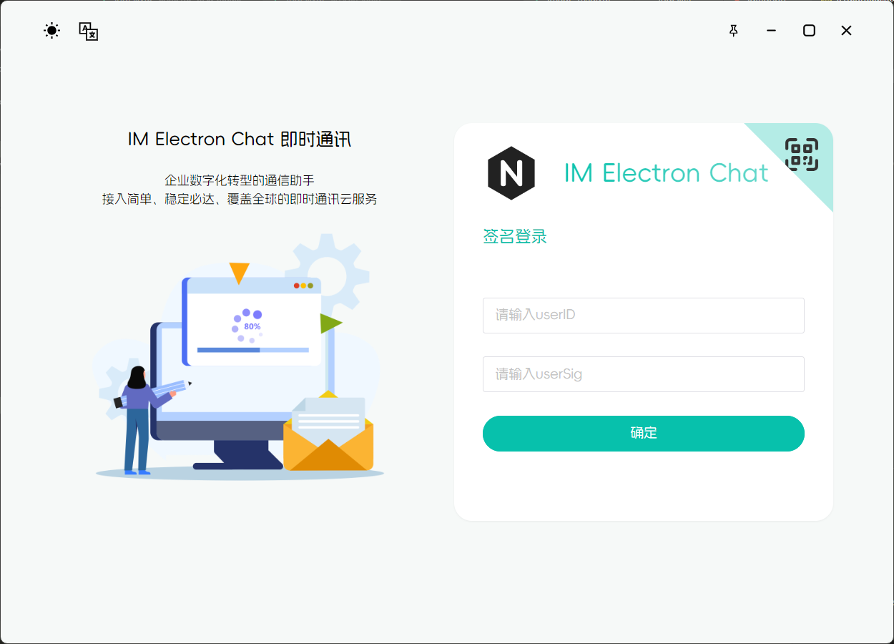

# TIM Electron Chat

## Project Info（项目简介）

本项目基于 Electron + Vue3 + TypeScript + Vite + NaiveUI + UnoCSS 开发，对腾讯云的TIM进行集成开发。由于腾讯云的TIM Electron demo项目仓库已被删除，此项目可作为参考。

## Download Experience（下载体验）

[Release](https://github.com/typeofNaN/tim-electron-chat/releases)

注：此安装包未配置`imSdkAppId`，只做展示使用，建议下载源码填入`imSdkAppId`后自行构建使用！！！

## TIM API Document（腾讯云TIM开发接口文档）

[接口文档](https://comm.qq.com/im/doc/electron/zh/)

## Usage（快速上手）

先去[腾讯云TIM官网](https://cloud.tencent.com/product/im)，注册申请TIM，将imSdkAppId复制，填入 `.env.xxx` 文件的 VITE_IM_SDK_APP_ID 配置项中。

开发环境：

``` sh
pnpm install

pnpm run dev

# 如果出现 throw new Error('Electron failed to install correctly, please delete node_modules/electron and try installing again'); 此类报错。则先执行：
cd node_modules/electron && node install.js

# 再到项目根目录重新运行
```

编译成可执行文件：

``` sh
pnpm run build
```

启动项目后，将`UserID`和`UserSig`填入登录页的输入框内。（如何获取`UserID`和`UserSig`参考腾讯云官网）

由于此项目暂未涉及服务端相关，可根据自身需要将账户登录改为服务端授权模式。

## Development Progress（开发进度）

- [x] 系统
  - [x] 主题切换
  - [x] 中/英文切换
  - [x] 自动检测更新
- [x] 账号登录
  - [x] 签名登录
  - [x] 扫码登录
  - [x] 登出
- [x] 个人中心
  - [x] 展示资料
  - [x] 更新资料
- [x] 即时通信
  - [x] 单聊
  - [ ] 群聊
- [x] 会话
  - [x] 未读消息统计
  - [x] 消息置顶/取消置顶
  - [x] 消息免打扰/取消消息免打扰
  - [x] 标记已读/未读
  - [x] 不显示会话
  - [x] 清空消息
- [x] 消息
  - [x] 消息通知
  - [x] 文本消息
  - [x] 图片消息
  - [x] 语音消息
  - [x] 自定义消息
  - [x] 文件消息
  - [ ] 群提示消息
  - [x] 表情消息
  - [x] 位置消息
  - [ ] 群通知消息
  - [x] 视频消息
  - [x] 好友关系变更通知
  - [ ] 资料变更通知
  - [x] 合并消息
  - [x] 无效消息
- [x] 消息操作
  - [x] 文件下载
  - [x] 视频静音播放
  - [x] 复制
  - [x] 文本朗读
  - [x] 消息转发
  - [x] 多选
  - [x] 引用
  - [x] 消息编辑
  - [x] 删除
  - [x] 撤回
- [x] 音视频通话
  - [x] 视频通话
  - [x] 语音通话
  - [ ] 群视频通话
  - [ ] 群语音通话
- [x] 搜索
  - [ ] 搜索聊天记录
  - [ ] 搜索联系人
  - [ ] 搜索群组
- [x] 通讯录
  - [x] 好友
  - [ ] 群组
  - [x] 好友申请
  - [x] 黑名单

## Project Preview（项目预览）

### Login Page（登录页面）



### My Info（我的信息）


### Search（搜索）


### Create Group（创建群组）


### Conv Operation（会话操作）


### Chat Page（聊天页面）


### Image Msg（图片消息）


### Merge Msg（合并消息）


### Send Emoji（发送表情）


### Msg Operation（消息操作）


### Chat Info（聊天信息）


### Friend Info（朋友信息）


### Edit Friend Remark（好友备注）


### Friend List（好友列表）


### Add friend（添加好友）


### My Group（我的群组）


### Friend Apply（好友申请）


### Blacklist（黑名单）


### Account Setting（账户设置）


### Edit Account Info（编辑账户信息）


### System Setting（系统设置）


### About（关于）


### I18n（多语言）


### Dark Mode（暗黑模式）


## TRTC音视频通话

项目已接入TRTC音视频通话，开发文档详见下方地址：

[TRTC开发文档](https://cloud.tencent.com/document/product/647/38551)

注：TRTC的签名函数可参考腾讯云官网自行生成。[签名方法](https://cloud.tencent.com/document/product/647/17275)

## License MIT
